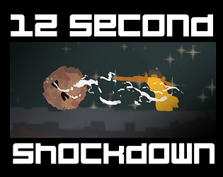

# 12 Second Shockdown

## A Stylish 12 Second Combofest
This was a game I made for the 72 hour game-jam: [KO!! Slam-Jam](https://itch.io/jam/ko-slam-jam). I used the 120 Seconds / Zing (⚡) theme for my project.

Play WebGL Version Here: https://sewermonk.itch.io/12-second-shockdown

## Setup
1. Use Unity Hub create a new project with Unity Version `2021.3.2f1`
2. Replace the newly created Assets folder with this repository
3. Install these Packages using the Unity Package Manager
   - TextMeshPro
   - ShaderGraph

## Tools Used
- Unity
- Visual Studio Code
- Clip Studio Paint
- Audacity

## Credits
| Content                                                             | Asset                            | Author                                                                                 |
| ------------------------------------------------------------------- | -------------------------------- | -------------------------------------------------------------------------------------- |
| Coding, Art, Vfx, Design                                            | *                                | Me                                                                                     |
| Music: [Alley Boss](https://www.youtube.com/watch?v=i7qdjDqi8fk)    | `SFX\Music\Alleyboss.mp3`        | [Waterflame](https://www.youtube.com/@WaterflameMusic)                                 |
| Music: [Sunwalker](https://www.youtube.com/watch?v=NA2KtP7xu6U)     | `SFX\Music\Sunwalker.mp3`        | [Waterflame](https://www.youtube.com/@WaterflameMusic)                                 |
| Music: [Welkin Sphere](https://www.youtube.com/watch?v=ZSpWtiGTLEs) | `SFX\Music\Velkinsphere.mp3`     | [Waterflame](https://www.youtube.com/@WaterflameMusic)                                 |
| Music: [Welkin Wing](https://www.youtube.com/watch?v=Pb9CaBuVt0g)   | `SFX\Music\Welkinwing.mp3`       | [Waterflame](https://www.youtube.com/@WaterflameMusic)                                 |
| Sound: All                                                          | `SFX` folder [Excluding `Music`] | DMC3 Sound Effects / [Angelglory](https://www.sounds-resource.com/playstation_2/dmc3/) |
| Typeface: Bump It Up                                                | `Fonts\BUMPITUP SDF.asset`       | [Aaronamar](https://fontstruct.com/fontstructions/show/155156/bump_it_up)              |
| Typeface: Cambria                                                   | `Fonts\CAMBRIA SDF.asset`        | Microsoft                                                                              |
